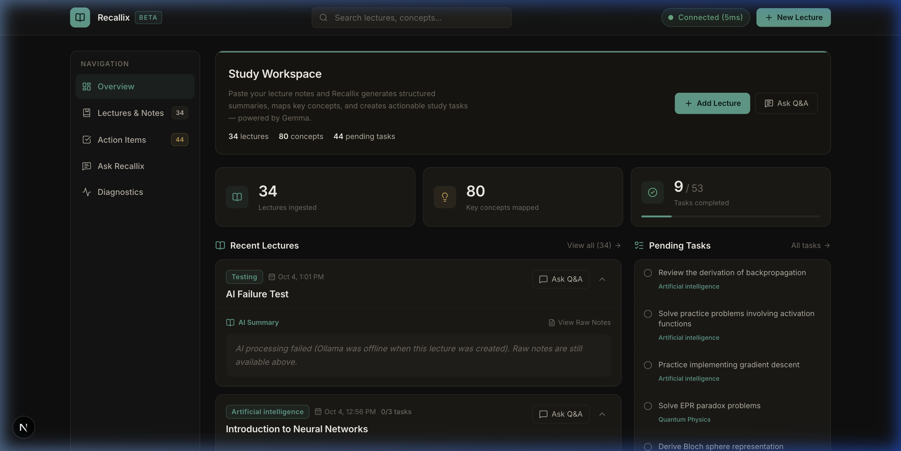
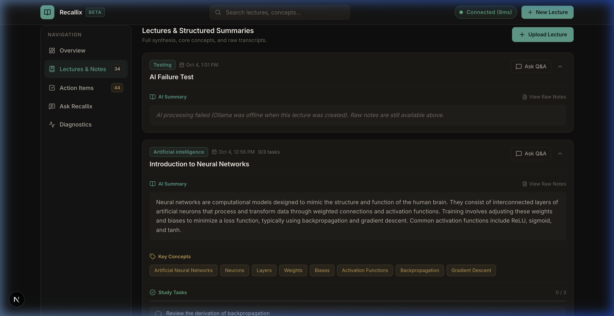
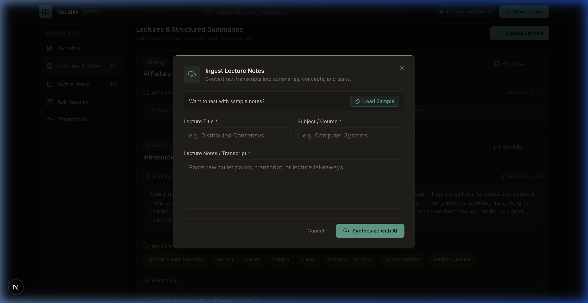
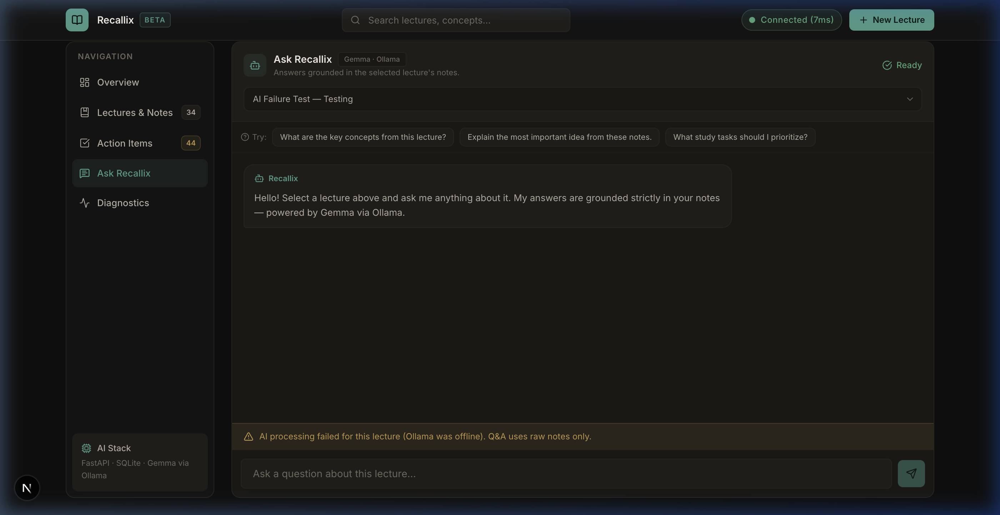

# Recallix — AI Study Assistant

Recallix turns raw lecture notes or transcripts into structured study material — AI-generated summaries, key concept tags, and actionable study tasks — and lets you ask follow-up questions grounded strictly in your own notes.

It runs entirely on your local machine using [Ollama](https://ollama.ai/) and [Gemma 3:1B](https://ollama.com/library/gemma3). No cloud API keys, no external data sharing.

---

## Screenshots

| Dashboard | Lectures & Summaries |
|-----------|----------------------|
|  |  |

| Add Lecture Modal | Ask Recallix (Q&A) |
|-------------------|---------------------|
|  |  |

---

## About

When studying from lecture notes, the useful work — pulling out the main ideas, naming the concepts, and deciding what to review — usually happens manually and inconsistently. Recallix automates that step.

Paste your notes or transcript. The backend sends them to a local Gemma model via Ollama and returns:

- A 2–4 sentence **summary** of the lecture's core ideas
- A list of **key concepts** extracted from the notes
- A short set of **study tasks** (e.g. "Review the derivation of X", "Solve problem set Y")

You can then open the Q&A tab and ask questions about any lecture. The model answers strictly based on the notes you provided — if the answer isn't in the notes, it says so.

---

## Key Features

- **Local-first AI** — runs on Ollama + Gemma 3:1B, nothing leaves your machine
- **Structured output** — every lecture gets a summary, concept tags, and tasks
- **Contextual Q&A** — ask questions about a specific lecture; the model is grounded to that lecture's notes
- **Grounded refusal** — the model declines to answer if the information is not in the notes
- **Graceful AI failure** — if Ollama is offline when a lecture is added, the notes are still saved with status `ai_failed`; raw notes remain available and Q&A still works once Ollama comes back
- **Task tracking** — study tasks can be toggled complete/incomplete
- **System diagnostics** — live backend health indicator showing latency and SQLite connectivity

---

## Tech Stack

| Layer | Technology |
|-------|------------|
| Frontend | Next.js 16 (App Router, Turbopack), React 19, TypeScript, Tailwind CSS v4 |
| Backend | Python, FastAPI, Pydantic v2, Uvicorn |
| Database | SQLite (via Python's built-in `sqlite3`) |
| AI Engine | [Ollama](https://ollama.ai/) running [Gemma 3:1B](https://ollama.com/library/gemma3) locally |
| HTTP client | HTTPX (backend → Ollama) |
| Icons | Lucide React |

---

## How It Works

```
Browser (Next.js)
      │
      │  POST /api/v1/lectures  (title, subject, raw notes)
      ▼
FastAPI Backend
      │
      │  HTTP POST /api/generate
      ▼
Ollama (localhost:11434)
      │
      │  Gemma 3:1B generates JSON:
      │  { summary, key_concepts[], action_items[] }
      ▼
FastAPI parses & validates output
      │
      │  INSERT INTO lectures (SQLite)
      ▼
Response → Next.js renders lecture card
```

**Q&A flow:** The frontend sends a question with a `lecture_id` → the backend fetches the lecture's raw notes from SQLite → constructs a grounded prompt → calls Gemma via Ollama → returns the answer as plain text. The system prompt explicitly instructs the model not to fabricate information not present in the notes.

---

## Prerequisites

Make sure the following are installed before starting:

- **Node.js** ≥ 18 and npm
- **Python** ≥ 3.11
- **Ollama** — [install from ollama.ai](https://ollama.ai/) and pull the model:

```bash
ollama pull gemma3:1b
```

> The model download is ~1 GB. Ensure Ollama is running (`ollama serve`) before starting the backend.

---

## Installation & Local Setup

### 1. Clone the repository

```bash
git clone <your-repo-url>
cd Recallix
```

### 2. Backend setup

```bash
cd backend

# Create and activate a Python virtual environment
python3 -m venv .venv
source .venv/bin/activate       # Windows: .venv\Scripts\activate

# Install dependencies
pip install -r requirements.txt

# (Optional) copy the env example and adjust if needed
cp .env.example .env
```

Default environment variables (from `.env.example`):

```env
OLLAMA_BASE_URL=http://localhost:11434
OLLAMA_MODEL=gemma3:1b
OLLAMA_TIMEOUT_SECONDS=120
SQLITE_DB_PATH=recallix.db
```

### 3. Frontend setup

```bash
cd frontend
npm install
```

---

## Running the Application

You need three things running at the same time: Ollama, the backend, and the frontend.

**Terminal 1 — Ollama**

```bash
ollama serve
```

**Terminal 2 — Backend** (from the `backend/` directory, with `.venv` activated)

```bash
cd backend
source .venv/bin/activate
python3 run.py
```

The FastAPI server starts at `http://127.0.0.1:8000`.

- Interactive API docs: [http://127.0.0.1:8000/docs](http://127.0.0.1:8000/docs)
- Health check: [http://127.0.0.1:8000/api/v1/health](http://127.0.0.1:8000/api/v1/health)

**Terminal 3 — Frontend** (from the `frontend/` directory)

```bash
cd frontend
npm run dev
```

Open [http://localhost:3000](http://localhost:3000) in your browser.

---

## How to Use Recallix

1. **Add a lecture** — click **New Lecture** (top-right) or **Add Lecture** on the dashboard. Fill in the title, subject, and paste your raw notes or transcript. Click **Synthesize with AI**.

2. **Review the output** — the lecture card shows the AI-generated summary, extracted key concept tags, and study tasks. Raw notes are accessible via the **View Raw Notes** link.

3. **Track tasks** — go to **Action Items** in the sidebar to see all pending study tasks across lectures. Click a task circle to mark it complete.

4. **Ask questions** — click **Ask Recallix** in the sidebar or **Ask Q&A** on any lecture card. Select the lecture, then type a question. The model answers using only that lecture's notes.

5. **Check system status** — the **Diagnostics** tab shows live backend latency, SQLite status, uptime, and Ollama connectivity.

> **Note:** Ollama must be running for AI processing. If it is offline when you add a lecture, the notes are saved with status `ai_failed` and a notice is shown in place of the summary. Raw notes are always preserved.

---

## Project Structure

```
Recallix/
├── README.md
├── .gitignore
│
├── docs/
│   └── screenshots/              # Application screenshots
│
├── frontend/                     # Next.js 16 + React 19 + Tailwind CSS v4
│   ├── package.json
│   ├── next.config.ts
│   └── src/
│       ├── app/
│       │   ├── layout.tsx        # Root layout
│       │   ├── page.tsx          # Main dashboard page
│       │   └── globals.css       # Design tokens & theme
│       ├── components/
│       │   ├── layout/           # Navbar, Sidebar
│       │   └── dashboard/        # StatsGrid, LectureCard, UploadLectureModal,
│       │                         # LectureChat, DiagnosticsView
│       ├── lib/
│       │   ├── api.ts            # FastAPI client
│       │   └── utils.ts          # Formatting helpers
│       └── types/                # TypeScript interfaces
│
└── backend/                      # Python + FastAPI + SQLite
    ├── requirements.txt
    ├── run.py                    # Development server entry point
    ├── .env.example
    └── app/
        ├── main.py               # FastAPI app & CORS configuration
        ├── core/
        │   ├── config.py         # Settings via Pydantic
        │   └── database.py       # SQLite connection & schema init
        ├── api/v1/
        │   ├── router.py
        │   └── endpoints/
        │       ├── health.py     # GET /api/v1/health
        │       └── lectures.py   # Lecture CRUD, task toggle, Q&A chat
        ├── schemas/
        │   ├── lecture.py
        │   ├── chat.py
        │   └── health.py
        └── services/
            ├── ollama_client.py  # HTTP client for Ollama /api/generate
            └── ai_service.py     # Prompt templates & response parsing
```

---

## API Endpoints

| Method | Path | Description |
|--------|------|-------------|
| `GET` | `/api/v1/health` | Backend & database health check |
| `GET` | `/api/v1/lectures` | List all lectures |
| `POST` | `/api/v1/lectures` | Create lecture and trigger AI processing |
| `GET` | `/api/v1/lectures/{id}` | Get a single lecture |
| `PATCH` | `/api/v1/lectures/{id}/tasks/{task_id}` | Toggle task completion |
| `POST` | `/api/v1/lectures/{id}/chat` | Ask a question about a lecture |

---

## Current Limitations

- **Ollama must be running locally** — there is no fallback AI provider.
- **No file upload** — notes must be pasted as plain text; PDF or audio import is not supported.
- **Context limit** — notes are trimmed to 6,000 characters before being sent to the model to stay within the token budget.
- **Single model** — only one Ollama model is configured at a time via `OLLAMA_MODEL`.
- **No user authentication** — this is a single-user local tool; all data is shared within the instance.
- **No note editing** — once a lecture is created, its raw notes cannot be edited through the UI.

---

## Future Improvements

- PDF and audio file ingestion (transcript extraction)
- Streaming AI responses in the Q&A chat
- Re-processing a lecture after Ollama comes back online
- Editing and deleting lectures
- Exporting summaries and tasks (Markdown, PDF)
- Search across all lecture content

---

*Recallix runs entirely locally. No account, no API key, and no external data transfer required.*
